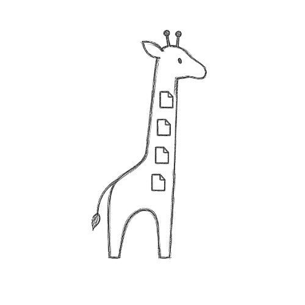

# Giraffile

  

Giraffile is a **local privacy** tool designed to share files quickly and securely without relying on cloud servers. 

### Why Giraffile?
In today’s world, sharing a file often means handing it over to a large corporation, storing it on an external server, and losing control over who has access to it. Giraffile cuts out the middleman. 

By using your browser’s native storage capabilities (**IndexedDB**), files travel directly from your device to the recipient’s. Once the timer expires, the file is permanently destroyed.

### Features
* **Zero-Server:** No intermediary servers. Your data never leaves your trusted network.
* **Self-Destruction:** Files are automatically deleted after the configured time.
* **100% Privacy:** No logs, no cloud databases, no tracking.
* **Dark Mode:** Designed for visual comfort in any environment.
* **Open Source:** You can verify the code and ensure your privacy is truly protected.

### How It Works
1. Drag your file to the drop zone.
2. Select the link’s expiration time.
3. Generate a unique link that you can send to anyone you need.
4. When the time expires, the file disappears forever.

---
*Developed by jahp / coffetron832 | Licensed under MIT.*
